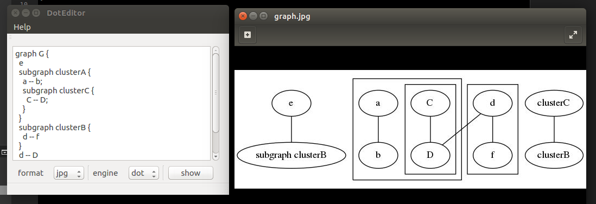

# DotEditor

## install
- test on Qt5 + Ubuntu16.04
- sudo apt-get install graphviz libgnome2-bin
- use QtCreator to build it.

## example
```
graph G {
  e
  subgraph clusterA {
    a -- b;
    subgraph clusterC {
      C -- D;
    }
  }
  subgraph clusterB {
    d -- f
  }
  d -- D
  e -- "subgraph clusterB"
  clusterC -- clusterB
}
```

## result


## secret
```
QString cmd;
   QString dottxt=ui->textEdit->toPlainText();
   QString format=ui->comboBox_format->currentText();
   QString engine=ui->comboBox_engine->currentText();
   QString dir=QDir::currentPath();

   QString basename=dir+"/graph";
   QString suffix=".txt";
   QString inputFile=basename+suffix;
   QString outputFile=basename+"."+format;

   QFile file(inputFile);
   if (!file.open(QIODevice::WriteOnly | QIODevice::Text)){
       qDebug()<<"cannot open file"<<inputFile;
       return;
   }

   QTextStream out(&file);
   out <<dottxt;
   file.close();

   cmd="/usr/bin/"+engine+" -T"+format+" "+inputFile+" -o"+outputFile;
//    qDebug()<<cmd;
//    bool det=QProcess::startDetached(cmd);
//    qDebug()<<"startDetached: "<<det<<cmd;
//    QStringList arguments;
//    arguments<<"-T"<<format<<inputFile<<"-o"<<outputFile;
//    QProcess::startDetached(engine,arguments);

   QFile runFile("run.sh");
   if (!runFile.open(QIODevice::WriteOnly | QIODevice::Text)){
       qDebug()<<"cannot open file run.sh";
       return;
   }

   QTextStream run(&runFile);
   run<<cmd;

   bool per=runFile.setPermissions(QFileDevice::ReadOwner|QFileDevice::WriteOwner|QFileDevice::ExeOwner|QFileDevice::ReadGroup|QFileDevice::WriteGroup|QFileDevice::ExeGroup|QFileDevice::ReadOther|QFileDevice::WriteOther|QFileDevice::ExeOther);
   runFile.close();

   qDebug()<<"run.sh:"<<per<<cmd;

   cmd="bash "+dir+"/run.sh";
   bool exe=QProcess::execute(cmd);
   qDebug()<<"execute: "<<exe<<cmd;

   cmd="gnome-open "+outputFile;
   qDebug()<<cmd;
   QProcess::startDetached(cmd);
```

## note
1. QProcess::startDetached() and QProcess::execute() cannot create output file;
2. write `cmd` to `run.sh`, then use `bash` to run it.
3. we need change the permission of `run.sh`
